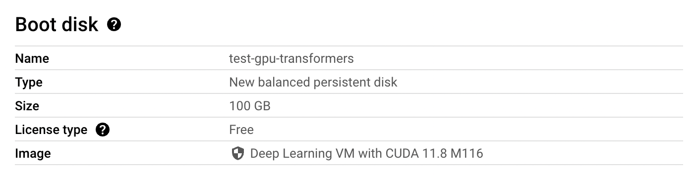

# Question 3 : Container Creation and Testing 

This folder contains resources and scripts for building a GPU-compatible Docker container with the  Transformers library. This setup allows for easy execution of LLM training within a container. 

In this Readme file, you'll find step by step explanations of how to build the image, distribute it to a GCP artifact registry, and test the container. 

## Contents

- `build_image/Dockerfile`: This file is used to build the Docker image. It sets up a GPU-compatible 
environment with the Transformers library, and other  libraries commonly used when training.
- `build_image/requirements.txt`: The requirements file with the necessary packages
- `launch_training.sh`: This script launches a training session within the Docker container.
- `app/test_training_bert_base.py`: This is an example Python script that performs a simple training.
- `volume/test_training_distillgpt2.py`: Another training example

## Requirements

The docker image was tested on a GCE instance, which requires docker installed, as well as a compatible Nvidia driver. Fortunately, we can use a VM image that comes with everything pre-installed. I have used this [deep learning image](https://console.cloud.google.com/compute/imagesDetail/projects/ml-images/global/images/c0-deeplearning-common-gpu-v20240128-debian-11-py310?project=hf-notebooks). 

## Dockerfile

The docker image uses a [Nvidia base image](https://hub.docker.com/layers/nvidia/cuda/12.1.0-base-ubuntu22.04/images/sha256-cdfb329c976faa680681226b22674b85a91c4f7e3bbce583a69d371b04f4ca40?context=explore) that provides cuda 12.1.0, 11.8 being the minimum version required for the H100 ([more info](https://forums.developer.nvidia.com/t/minimum-required-cuda-version-by-gpu/276955)).

It adds additional layers such as python and pip installation, as well as the installation of the python packages required for the training of an LLM. Note that the `requirements.txt` file is copied into the working directory of the container and not every file in the directory. This way we take advantage of the caching mecanism of Docker. We can work on modifying our training code and whenever we build the image we don't need to build the installation steps all over again.

The env variable **HF_HOME** that caches model checkpoints is redefined to be in the `/volume/` folder with the purpose of saving those on a volume, and not download them again once we launch a new container. The `output_dir` variable of the TrainingArgs should be set to `/volume/model_name` as well, for the same reasons.


## Usage


### Prepare the docker image and the container registry

The first step is to build the image and upload it to a container registry. 

- **Bash variables**
  
The bash variables below are here for you to replace with your own values.

```bash
LOCATION=us-east4
PROJECT=hf-notebooks
REPO_NAME=gpu-transformers
IMAGE_NAME=gpu_transformers
```

- **Build the Docker image**

```bash
docker build -t $IMAGE_NAME:v1 .
```

- **Create a repository in the container registry**


For this demo, I have decided to use the artifact registry on GCP. 

To create a repository, we can do it via the [Console](https://cloud.google.com/artifact-registry/docs/repositories/create-repos) or directly using the CLI, from [Cloud Shell](https://cloud.google.com/shell), by simply calling the correct API using gloud : 

```bash
gcloud artifacts repositories create $REPO_NAME\
                                    --repository-format=docker \
                                    --location=$LOCATION
```

- **Upload the docker image to the registry**

We first need to configure docker, by configuring gcloud as the credential helper for the Artifact Registry domain associated with the repository location (in our case the domain is `us-east4-docker.pkg.dev`)  :

```bash
gcloud auth configure-docker $LOCATION-docker.pkg.dev
```

Then tag the image with the required named to match the repository domain : 

```bash
docker tag $IMAGE_NAME:v1 $LOCATION-docker.pkg.dev/$PROJECT/$REPO_NAME/$IMAGE_NAME:v1
```

And finally push the image to the repo : 

```bash
docker push $LOCATION-docker.pkg.dev/$PROJECT/$REPO_NAME/$IMAGE_NAME:v1
```

### Run the container on a GCE instance

- **Create the GCE instance**

We can create an instance via the console or via the CLI. For the example here we will use the console specifying the name of the instance, the GPU type and the region : 


The other important detail is to use a deep learning image as mentionned above and define a sufficient disk size for the model checkpoints :



The service account attached to the instance should have the role `roles/artifactregistry.reader` (check the [documentation](https://cloud.google.com/artifact-registry/docs/access-control)).

Click create and ssh into the instance from the console. 

- **Run a container**

We can run the container from the instance, using the `--gpus all` argument to use all available GPUs on the host, and attaching a volume to the container: 

```bash
CONTAINER_NAME=$LOCATION-docker.pkg.dev/$PROJECT/$REPO_NAME/$IMAGE_NAME:v1
VOLUME=~/hf-docker-app-gpu-transformer/volume
docker run --gpus all -v ${VOLUME}:/volume ${CONTAINER_NAME}  python3 /app/test_training_bert_base.py
```

The `test_training_bert_base.py` is launched in the `/app/` directory of the container. There are actually two ways of passing a training python script depending on usage. We can either pass it when building the image or by copying it to the volume. 

For a CI pipeline that builds the image, we can copy the python script as a last step in the Dockerfile, and update the version for each minor/major changes. 
For testing purposes however, we don't necessarily need to rebuild the image evertime there is a change, we can work directly in the volume attached to the container.


